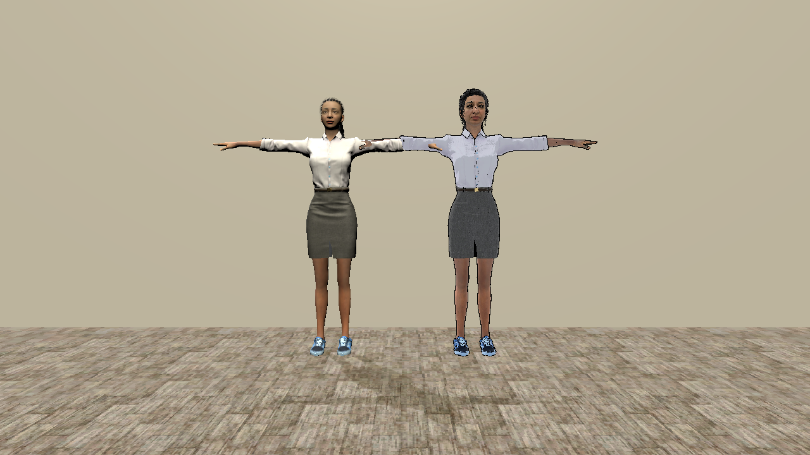
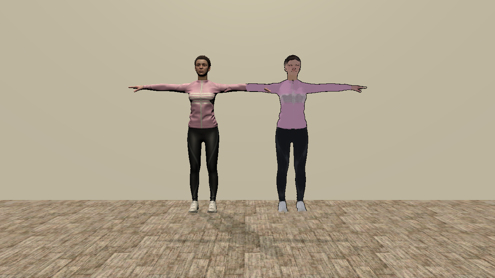

# Abstraction Mechanisms for Virtual Avatars

Unity source code accompanying the master's thesis *Abstraction Mechanisms for Virtual Avatars*.

**Nidanur Günay**
Department of Computer and Information Science, University of Konstanz, 2026
First reviewer: Prof. Dr. Oliver Deussen · Second reviewer: Prof. Dr. Tiare Feuchtner

---

## Overview

This repository contains the non-photorealistic rendering (NPR) implementations described in Chapters 4 and 5
of the thesis. Eight abstraction techniques were developed and ported across three avatar platforms whose
rendering architectures differ substantially:

| Platform | Character | Rendering architecture |
| --- | --- | --- |
| Mixamo | Jody | Standard URP mesh renderer, painted albedo textures |
| Avaturn | Photographic avatar | glTF import through glTFast, photographic albedo textures |
| Meta Avatars SDK | Meta Avatar | Closed SDK pipeline, single fragment hook, no additional passes |

The Mixamo and Avaturn platforms accept ordinary material shaders and URP renderer features. The Meta Avatars
SDK does not. Its shading runs inside the SDK's own uber shader, so every technique had to be injected through
one per-fragment hook that executes after the SDK's physically based lighting. This constraint drives most of
the architectural differences visible in the table below.

---

## Techniques and source files

The table below maps each thesis technique to its source file. On the Meta Avatars SDK, each technique is a
`.cginc` selected by a shader keyword and dispatched from `Style2MetaAvatarCore.hlsl`.

Shader files carry descriptive names rather than version numbers, for two reasons. The numbering used during
development ran ahead of the numbering in the thesis, since V1 was later split into the outline and toon
shading techniques and X-Toon was inserted as V2.2. The Mixamo and Avaturn shaders are also cumulative: each
one contains the outline pass, X-Toon shading and every operator introduced before it, so a file named after a
single technique would misrepresent what it holds. `SobelEdgeDetection.shader`, for instance, is the full
composite of outline, X-Toon shading and the Sobel operator.

| Thesis | Technique | Mixamo / Avaturn | Meta Avatars SDK | SDK keyword |
| --- | --- | --- | --- | --- |
| V1 | Geometric silhouette outline | [`ToonShading_Outline.shader`](Assets/Shaders/JadeNPRShaders/ToonShading_Outline.shader), [`InvertedHullOutline.shader`](Assets/Shaders/CommonNPRShaders/InvertedHullOutline.shader) | `NPROutline` pass in [`Avatar-Meta-UGB.shader`](Assets/Shaders/MetaAvatarShaders/Avatar-Meta-UGB.shader) | `OUTLINE_PASS` |
| V2 | Toon shading | [`ToonShading_Outline.shader`](Assets/Shaders/JadeNPRShaders/ToonShading_Outline.shader) | [`NPREffect_Toon.cginc`](Assets/Shaders/MetaAvatarShaders/NPREffect_Toon.cginc) | `EFFECT_TOON` |
| V2.2 | X-Toon shading | [`XToon_2DRamp.shader`](Assets/Shaders/JadeNPRShaders/XToon_2DRamp.shader) | [`NPREffect_XToon.cginc`](Assets/Shaders/MetaAvatarShaders/NPREffect_XToon.cginc) | `EFFECT_XTOON` |
| V3 | Screen-space normal edge detection | [`NormalEdgeDetection.shader`](Assets/Shaders/JadeNPRShaders/NormalEdgeDetection.shader) | [`NPREffect_NormalEdge.cginc`](Assets/Shaders/MetaAvatarShaders/NPREffect_NormalEdge.cginc) | `EFFECT_NORMAL_EDGE` |
| V4 | Sobel edge detection | [`SobelEdgeDetection.shader`](Assets/Shaders/JadeNPRShaders/SobelEdgeDetection.shader) | [`NPREffect_Sobel.cginc`](Assets/Shaders/MetaAvatarShaders/NPREffect_Sobel.cginc) | `EFFECT_SOBEL` |
| V4.2 | Gaussian prefiltered Sobel | [`GaussianPrefilteredSobel.shader`](Assets/Shaders/JadeNPRShaders/GaussianPrefilteredSobel.shader) | [`NPREffect_GaussianSobel.cginc`](Assets/Shaders/MetaAvatarShaders/NPREffect_GaussianSobel.cginc) | `EFFECT_GAUSS_SOBEL` |
| V5 | Hierarchical edge detection, multiple cues | [`PostProcess_HierarchicalEdgeDetection.shader`](Assets/Shaders/JadeNPRShaders/PostProcess_HierarchicalEdgeDetection.shader) + [`EdgeDetectionFeature.cs`](Assets/AvatarShaderExperimental/Scripts/Rendering/EdgeDetectionFeature.cs) | [`NPREffect_Hierarchical.cginc`](Assets/Shaders/MetaAvatarShaders/NPREffect_Hierarchical.cginc) | `EFFECT_HIERARCHICAL` |
| V6 | Kuwahara painterly filter | [`AnisotropicKuwahara.shader`](Assets/Shaders/JadeNPRShaders/AnisotropicKuwahara.shader) + [`AnisotropicKuwaharaFeature.cs`](Assets/AvatarShaderExperimental/Scripts/Rendering/AnisotropicKuwaharaFeature.cs) | [`NPREffect_Kuwahara2.cginc`](Assets/Shaders/MetaAvatarShaders/NPREffect_Kuwahara2.cginc) | `EFFECT_KUWAHARA` |

Avaturn uses the same technique set under [`Assets/Shaders/AvaturnNPRShaders/`](Assets/Shaders/AvaturnNPRShaders/).
The two platforms diverge mainly in normal-map decoding and in the head texture preprocessing that V4 requires,
both documented in Chapter 5 of the thesis.

### A note on V5

Two files carry hierarchical edge detection for Mixamo and Avaturn, and only one matches the thesis. The
results reported in the thesis were produced by `PostProcess_HierarchicalEdgeDetection.shader`, a URP renderer feature
running as a full-screen post-process. It applies the Roberts Cross operator to the real scene depth, normal
and colour buffers. The similarly named `HierarchicalGaussian_Forward.shader` is a later forward material shader
that approximates the same cues with screen-space derivatives, and it is not the implementation Chapter 5
describes. Both are kept here so the historical record is complete.

The Meta Avatars SDK cannot run a post-process pass, so its V5 reconstructs the cues per fragment inside
`NPREffect_Hierarchical.cginc`, with an adaptive gain following the AHEAD approach.

### What is not here

Exploratory work that the thesis does not report has been removed, so every Meta Avatars SDK effect that
remains corresponds to a technique in Chapter 4. The two combination effects from an earlier plan, Kuwahara
with Sobel and a Kuwahara, Gaussian and hierarchical composite, were dropped before the Methodology chapter
was finalised and are gone along with the halftone, hatching and toon combination variants. Duplicate BT.709
luma variants and superseded Kuwahara revisions were removed as well.

A few files remain that are not part of the reported technique set, each for a reason. `ChromaticEdge.shader`
and `QuantizedSobel.shader` are still assigned to Avaturn material sets. `HalftoneHatching.shader` and
`MultiScaleKuwahara.shader` back a renderer feature and a material set that the scenes still reference.
`AvatarMaskCapture.shader` is resolved by name from three renderer features. `HierarchicalGaussian_Forward.shader`
is kept for the reason given above.

---

## Scenes

| Scene | Purpose |
| --- | --- |
| [`Assets/Scenes/metavatars.unity`](Assets/Scenes/metavatars.unity) | Meta Avatars SDK platform scene, in-VR technique switching |
| [`Assets/Scenes/Avaturn.unity`](Assets/Scenes/Avaturn.unity) | Avaturn platform scene |
| [`Assets/Scenes/MixamoJade.unity`](Assets/Scenes/MixamoJade.unity) | Mixamo (Jody) platform scene |
| [`Assets/Avaturn NPR.unity`](Assets/Avaturn%20NPR.unity) | Avaturn with the NPR pipeline applied |
| [`Assets/Scenes/Video Recording.unity`](Assets/Scenes/Video%20Recording.unity) | Stimulus recording setup for the user study, 20° field of view |
| [`Assets/AvatarShaderExperimental/Scenes/Project Scene.unity`](Assets/AvatarShaderExperimental/Scenes/Project%20Scene.unity) | Main Mixamo development scene |
| [`Assets/AvatarShaderExperimental/Scenes/Kuwahara and hieararchical.unity`](Assets/AvatarShaderExperimental/Scenes/Kuwahara%20and%20hieararchical.unity) | V5 and V6 painterly filter tests |

The three platform scenes share a common studio environment so that comparison renders use an equivalent
viewpoint, as described in Chapter 5.

The Mixamo and Avaturn scenes each hold two avatars under a single `Avatars` group: `Avatar (Original)` with
its unmodified materials, and `Avatar (NPR)` carrying the composite evaluated as condition C3, which combines
the silhouette outline, X-Toon shading and Sobel edge detection. Every other stylisation is reproduced by
assigning the matching material set to the avatar, so the scenes ship with one example of each rather than one
avatar per technique.

---

## How the NPR shader reaches a Meta avatar

Avatars in the Meta Avatars SDK are constructed at runtime, so their materials cannot be assigned in the
Editor. The SDK instead builds them from a shader configuration asset. This project supplies its own:

[`MetaNPRShaderConfiguration.asset`](Assets/Shaders/MetaAvatarShaders/MetaNPRShaderConfiguration.asset) points
the SDK at `Avatar-Meta-UGB.shader` and maps the SDK's texture and colour parameter names onto it. The
`metavatars` scene overrides both `DefaultShaderConfigurationInitializer` and
`CelShaderConfigurationInitializer` on the SDK manager to use it, which means every avatar is created with the
NPR shader already attached. No material swap after loading is required.

## Runtime tooling

| Script | Function |
| --- | --- |
| [`NPREdgeDetectionUI`](Assets/Scripts/NPREdgeDetectionUI.cs) | The in-VR modification interface. A world-space panel driven by controller raycasting that collects every material using the NPR shader, switches technique by toggling the shader keywords, and pushes parameter changes to those materials live. Tuned values persist through `PlayerPrefs`. |
| [`AvatarFreezeController`](Assets/Scripts/AvatarFreezeController.cs) | Freezes the avatar pose so comparison renders capture an identical configuration |
| [`AvatarSwitcher`](Assets/Scripts/AvatarSwitcher.cs) | Cycles between loaded avatars in the comparison scene |
| [`AvatarLabel`](Assets/Scripts/AvatarLabel.cs) | Floating billboard label identifying the active technique |
| [`CameraCoordinateOverlay`](Assets/Scripts/CameraCoordinateOverlay.cs) | Displays camera position and framing, used to match viewpoints across platforms |
| [`ScreenshotController`](Assets/Scripts/ScreenshotController.cs) | Captures the comparison figures used in the thesis |

`ShaderSwapper.cs` is an earlier approach that assigned materials after avatar load. It was superseded by the
shader configuration asset and is not attached to any scene. It is kept only as a record of the development
history.

---

## Requirements

- Unity **2022.3.62f3** (LTS)
- Universal Render Pipeline 14.0.12
- Meta Avatars SDK 40.0.1, installed separately (see [SETUP.md](SETUP.md))
- Meta Quest headset for the VR scenes, though the Mixamo and Avaturn scenes run in the Editor

All Unity packages resolve automatically from `Packages/manifest.json` on first open.

---

## Getting started

Clone the repository, open it in Unity 2022.3.62f3, then follow [SETUP.md](SETUP.md) to install the Meta
Avatars SDK and restore the assets that cannot be redistributed. Opening the project before the SDK is
installed produces compile errors in the Meta Avatar shaders, which is expected.

---

## Licence and third-party content

Original code in this repository is released under the MIT Licence, see [LICENSE](LICENSE). Third-party assets,
including the Meta Avatars SDK, the Mixamo character and animations, and the Asset Store environment textures,
remain under their own licences and are documented in [THIRD_PARTY.md](THIRD_PARTY.md).

User study video stimuli, audio recordings and facial capture data are excluded from this repository for data
protection reasons.
